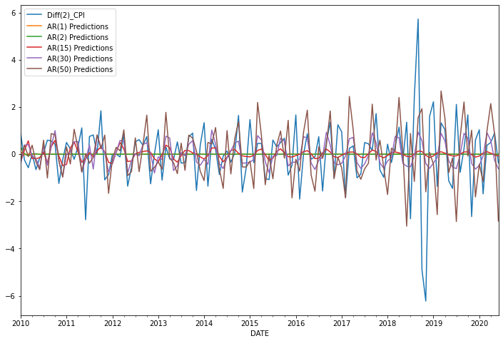
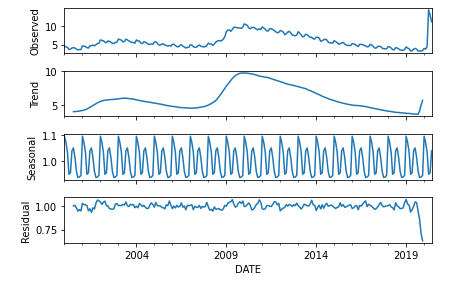
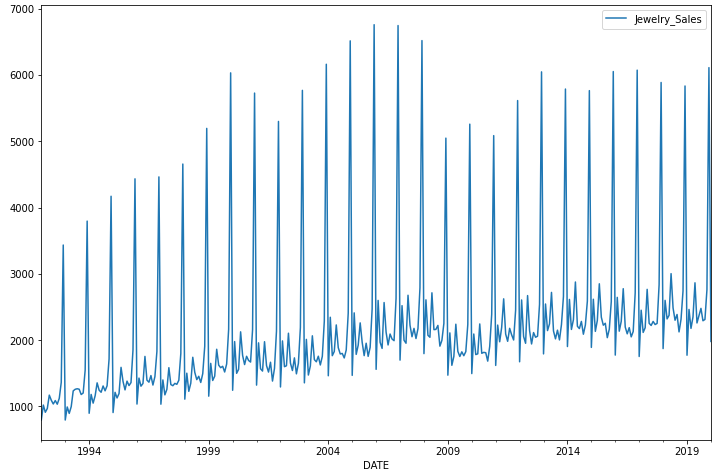
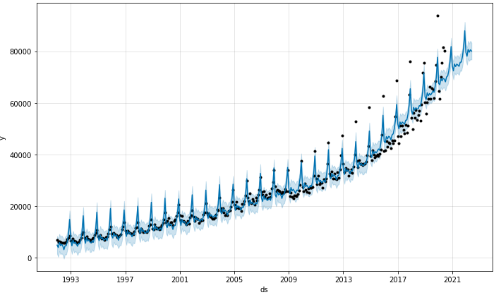

# Time_Series_Analysis

Time series analysis is the primary tool in most sciences and one of the most important areas of analysis for data scientists. 
Inferences to be obtained from events changing with the effect of time and marking these effects are very useful for establishing causality and meaning relationships.

In this repository, you will find various characteristics of time series and forecasting models.

 

